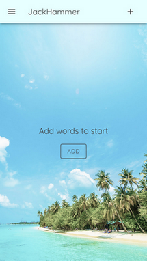
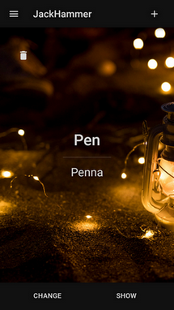
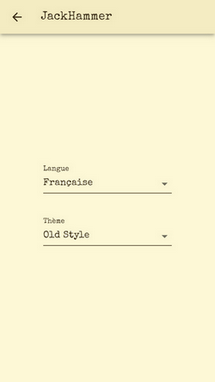
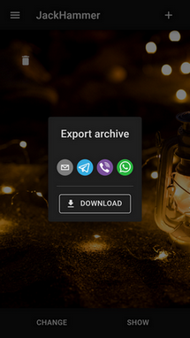

# JackHammer

Tiny fast flashcard cross-platform app. [Live demo](https://jackhammer-204e5.firebaseapp.com/) (experimental).

Small Cordova app for language learning. I was bored by too many options and fields of classic flashcards apps. This app provides the essential features to add and delete words, import and export word lists, and some shortcut to speed up the addition and deletion of words. It also provides some pretty themes and UI language. App available for web (experimental), iOS and Android. Download available (maybe 😴) on **Play and App Store**.

# Realized with:

- Typescript
- React
- Redux
- Cordova
- Webpack
- Babel
- ESLint & Prettier
- Workbox
- Firebase
- Material UI

**Other minor packages:**

- react-share (my fork with InAppBrowser support)
- uuidv4-validator
- app-translator
- cordova-plugin-inappbrowser

# Available languages

- English
- Italian
- French

# Scripts

| Command          | Description                |
| :--------------- | :------------------------- |
| `start`          | Start webpack dev server   |
| `build:webpack`  | Webpack build              |
| `build:android`  | Cordova Build for Android  |
| `build:ios`      | Cordova Build for iOS      |
| `lint`           | Run ESLint                 |
| `lint:fix`       | Run ESLint autofix         |
| `deploy:hosting` | Deploy to firebase hosting |

# Credits

- Export buttons: [nygardk/react-share](https://github.com/nygardk/react-share)
- Light theme background: [mrsiraphol](https://www.freepik.com/mrsiraphol)
- Old Style theme background: [kjpargeter](https://www.freepik.com/kjpargeter)
- Dark Theme theme background: [dia de velitas](https://co.pinterest.com/mariana16bermud/dia-de-velitas/)

# License

JackHammer released under MIT License. See LICENSE for details.
